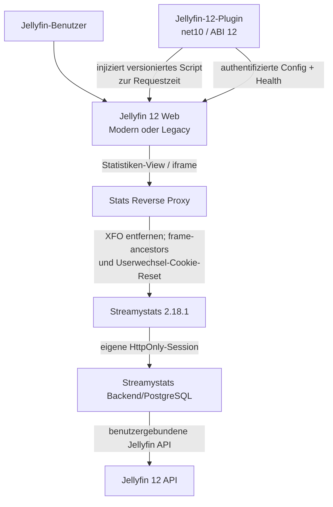
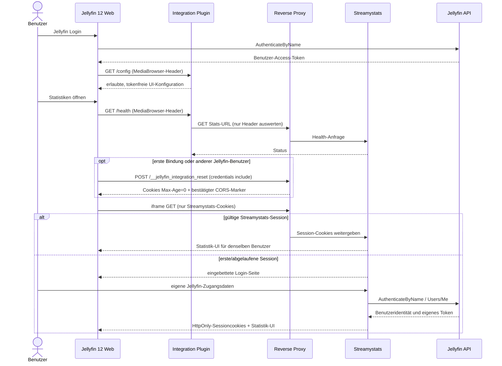

# Architekturentscheidung

## Gewählte Lösung

Die Integration besteht aus einem Jellyfin-12-Serverplugin, einem eingebetteten Clientmodul und einer engen Reverse-Proxy-Regel für Streamystats.

### Verantwortlichkeiten

- **Plugin:** Dashboard-Konfiguration, Benutzer-Allowlist, validierte öffentliche Stats-URL, Healthcheck, Clientasset und request-time Injection.
- **Client:** Menüpunkt, History-Eintrag, responsive Shell, iframe, Laden/Fehler/Retry/Browser-Fallback. Keine Credentials.
- **Proxy:** TLS, Forwarded-Header, Upgrades, ausschließlich am Stats-vHost XFO entfernen, exakte Frame-Policy setzen und am festen Reset-Pfad Streamystats-Cookies löschen.
- **Streamystats:** Login, Session, Autorisierung und Benutzer-/Bibliotheksfilter. Es bleibt die Security Boundary für Statistikdaten.

## Daten- und Authentifizierungsfluss

Das Jellyfin-Token verlässt den Jellyfin-Client nicht in Richtung Plugin oder Streamystats, abgesehen vom normalen Authorization-Header an Jellyfin-eigene Pluginendpunkte. Das Streamystats-Login läuft direkt zwischen Browser, Streamystats und Jellyfin.

## Öffentliche und interne Abhängigkeiten

| Teil | Typ | Stabilität | Update-Prüfung |
|---|---|---:|---|
| `BasePlugin<T>`, `IHasWebPages`, Controller, DI | Jellyfin Plugin-API | mittel/öffentlich | gegen 12.0 NuGet bauen |
| `IStartupFilter` | ASP.NET Core | stabil, aber kein Jellyfin-Extensionpoint | Index-Middleware-Integrationstest |
| `/web`, `/web/`, `/web/index.html` | Jellyfin Hostingstruktur | intern | Response enthält genau ein Script |
| Modern `.MuiAppBar-root`, Navigation-Links | Web-DOM intern | niedrig | Playwright Contract Tests |
| Legacy `.mainDrawer`, `.navMenuOption` | Web-DOM intern | niedrig | Playwright Contract Tests |
| Neutraler `#streamystats-integration`-History-State + eigener Overlay-Root | Browserstandard; bewusst weder Modern-Pfadroute noch Legacy-`#!/…` | hoch | Unit/E2E |
| Streamystats URL und Cookies | Streamystats öffentliches Verhalten | mittel | Smoke-Test je gepinnter Version |
| XFO/CSP-Header | Webstandard | hoch | `curl`/Browser-Test |

## Ausfallsicherheit

Die Middleware arbeitet nur bei HTML-GETs auf dem Web-Shell-Pfad, entfernt Range/Kompression für diese Antwort, puffert die Antwort und injiziert idempotent vor `</body>`. Bei jeder Ausnahme wird die originale Seite ausgeliefert. Plugin deaktiviert sich clientseitig außerhalb Jellyfin 12.

Der Healthcheck hat Timeout, folgt keinen Redirects, ruft exakt die konfigurierte öffentliche oder interne HTTP(S)-URL auf, liest keinen Antwortbody und gibt keine internen Exceptiondetails an Benutzer aus. Die UI kann jederzeit zum Browser-Fallback wechseln.
